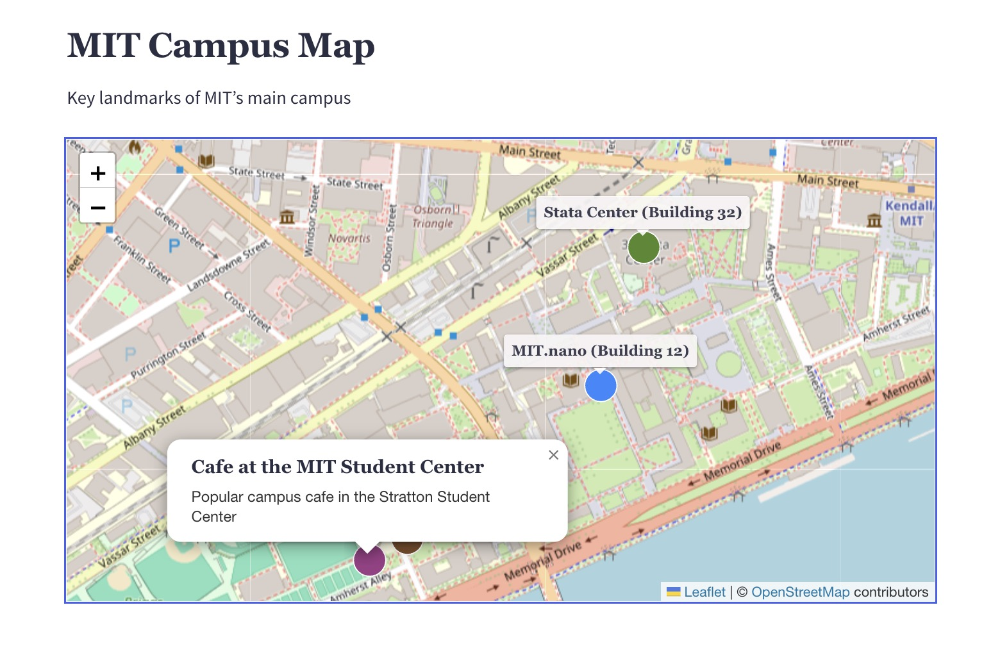

# Kirby Leaflet Map

A map block for Kirby with markers and paths, based on [Leaflet](https://leafletjs.com/) and [OpenStreetMap](https://www.openstreetmap.org/). No API key, no Google, and with an optional tile proxy your visitors never contact a third-party server.

[](https://github.com/tearoom1/kirby-leaflet-map)

## Features

- Map block for Kirby's block and layout editor
- Markers with title, description, size and color
- Paths with their own color, drawn directly on the map in the panel
- Location picker in the panel: search an address, click on the map or drag the marker
- The map automatically shows all locations and paths, or centers on a chosen location
- Labels always visible, on hover or only in the popup, per map or per location
- Embedded map or a thumbnail that opens the map in an overlay
- Default, minimum and maximum zoom per map
- Privacy friendly: tile proxy on your own server or a "load map" button before anything is loaded
- Works with any Leaflet tile provider
- English and German translations, works on single- and multi-language sites

## Requirements

- Kirby 4 or 5
- PHP 8.1+

## Installation

### Composer

```
composer require tearoom1/kirby-leaflet-map
```

### Git submodule

```
git submodule add https://github.com/tearoom1/kirby-leaflet-map.git site/plugins/kirby-leaflet-map
```

### Download

Download and copy this repository to `/site/plugins/kirby-leaflet-map`.

## Usage

Add the block to the fieldsets of your blocks or layout field:

```yaml
fieldsets:
  - leaflet-map
```

Include the plugin's CSS and JavaScript in your templates, e.g. in the header and footer snippets:

```php
<?php snippet('leaflet-map/css') ?>
<?php snippet('leaflet-map/js') ?>
```

Each map block can be configured in the panel:

1. Title and description
2. Display mode: embedded or a thumbnail that opens the map in an overlay
3. Zoom levels: default, minimum and maximum
4. Labels: set per location, always visible, on hover or only in the popup
5. Locations: title, description, size (1–5), color, label, hidden, map center
6. Paths: name, color, label and the line drawn on the map

Without a location marked as map center, the map shows all locations and paths. It zooms in at most to the default zoom and out below the minimum zoom if needed.

The title of a location appears as a label above the marker and in the popup when the marker is clicked, the description only in the popup.

### Path editor

Paths are drawn with the `leaflet-path` field: click on the map to add a point, drag a point to move it and click it to remove it. It stores a list of points:

```php
foreach ($page->route()->yaml() as $point) {
    echo $point['lat'] . ', ' . $point['lng'];
}
```

### Location picker

Locations and path points are set with the `leaflet-location` field. Search an address, click on the map to place the marker, drag it to adjust it or enter the coordinates directly.

The field can be used in your own blueprints as well:

```yaml
location:
  label: Location
  type: leaflet-location
  center: [48.137, 11.576]  # optional, map center while no location is set
  zoom: 12                  # optional
```

It stores the coordinates as `lat` and `lng`:

```php
$location = $page->location()->yaml();
echo $location['lat'] . ', ' . $location['lng'];
```

The address search uses [Nominatim](https://nominatim.org/) by default. Requests are sent from your server, are only available to logged-in panel users, are limited to one per second and are cached for a week, as required by the [Nominatim usage policy](https://operations.osmfoundation.org/policies/nominatim/).

## Privacy

By default, map tiles are loaded from the OpenStreetMap servers, which transfers the IP address of your visitors to them. There are two ways to avoid this:

### Tile proxy

```php
'tearoom1.leaflet-map.tiles.proxy' => true,
```

Tiles are fetched by your server and stored in `media/leaflet-map/tiles`. From then on your web server delivers them directly, without PHP. Each map only allows the tiles around its own locations and within its zoom levels, so the proxy can't be used to download arbitrary tiles. The cache is renewed every month.

Make sure your server is allowed to connect to the tile provider and has some disk space for the tiles. For sites with a lot of traffic, use your own or a commercial tile provider (see `tiles.url`), the [OpenStreetMap tile usage policy](https://operations.osmfoundation.org/policies/tiles/) applies.

### Load on click

```php
'tearoom1.leaflet-map.loadOnClick' => true,
```

Embedded maps show a notice and a "Load map" button. Nothing is loaded from the tile server until the visitor clicks it.

## Configuration

All options are optional:

```php
return [
    'tearoom1.leaflet-map' => [
        'tiles.url'          => 'https://tile.openstreetmap.org/{z}/{x}/{y}.png',
        'tiles.attribution'  => '&copy; <a href="https://www.openstreetmap.org/copyright">OpenStreetMap</a> contributors',
        'tiles.maxZoom'      => 19,
        'tiles.proxy'        => false,
        'tiles.userAgent'    => 'kirby-leaflet-map (+https://example.com)',
        'loadOnClick'        => false,
        'geocoder'           => true,
        'geocoder.url'       => 'https://nominatim.openstreetmap.org/search',
        'panel.center'       => [20, 0],
        'panel.zoom'         => 2,
        'alwaysIncludeAssets' => true,
        'enabled'            => true,
    ],
];
```

| Option | Default | Description |
|--------|---------|-------------|
| `tiles.url` | OpenStreetMap | Tile URL template for Leaflet, any provider works |
| `tiles.attribution` | OpenStreetMap | Attribution shown on the map, required by most providers |
| `tiles.maxZoom` | `19` | Highest zoom level the tile provider offers |
| `tiles.proxy` | `false` | Load tiles through your own server (see Privacy) |
| `tiles.userAgent` | plugin name and site URL | User agent for requests to the tile provider and geocoder |
| `loadOnClick` | `false` | Embedded maps only load after a click (see Privacy) |
| `geocoder` | `true` | Address search in the location picker |
| `geocoder.url` | Nominatim | Nominatim compatible search endpoint |
| `panel.center` | `[20, 0]` | Center of the picker map while no location is set |
| `panel.zoom` | `2` | Zoom of the picker map while no location is set |
| `alwaysIncludeAssets` | `true` | Include CSS and JS on every page, otherwise only on pages with a map block |
| `enabled` | `true` | Set to `false` to stop including the plugin's CSS and JS |

Texts can be changed with Kirby's translations, the keys start with `tearoom1.leaflet-map.`

## License

This plugin is licensed under the [MIT License](LICENSE)

## Credits

- [Mathis Koblin](https://www.tearoom.one)
- Built with [Leaflet](https://leafletjs.com/)
- Map data © [OpenStreetMap](https://www.openstreetmap.org/copyright) contributors, address search by [Nominatim](https://nominatim.org/)

[](https://coff.ee/tearoom1)
